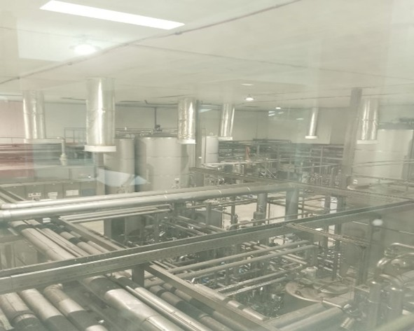
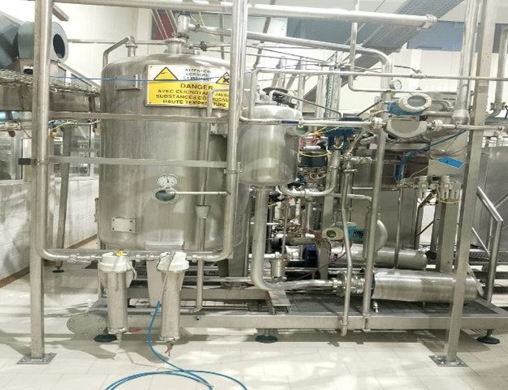
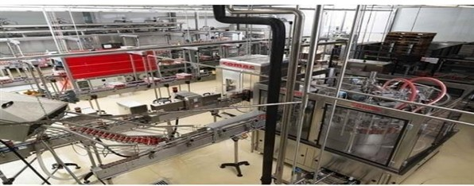
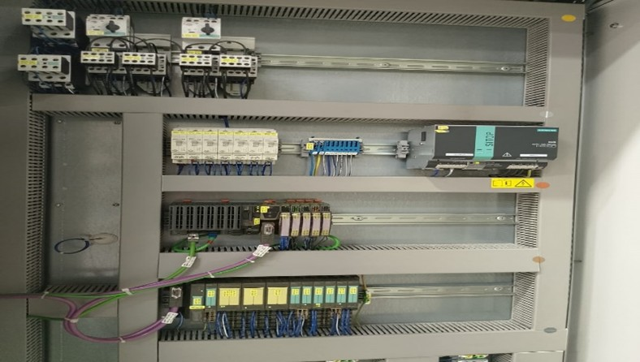
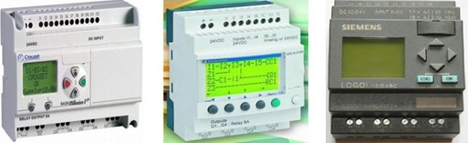
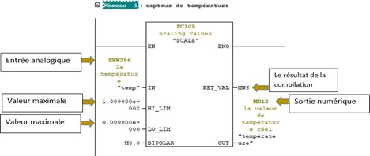
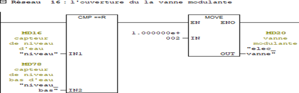
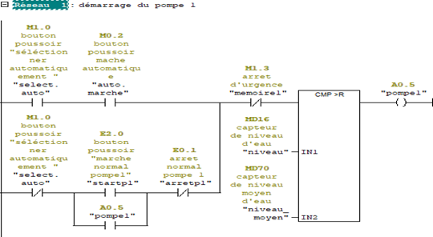
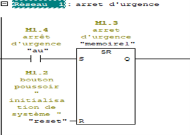

# 🥤 Industrial Thermal Automation & Energy Optimization
**Technical Internship | ECCBC (Equatorial Coca-Cola Bottling Company) - Morocco**
**Field: Industrial Automation, Thermal Engineering & Energy Management**

---

## 📑 Project Abstract
This project focused on the automation and optimization of the industrial heating system at the **ECCBC Casablanca** bottling plant. The primary objective was to replace manual thermal regulation with an automated, sensor-driven system using **Siemens PLCs**. By implementing precise PID-like control and real-time monitoring via **WinCC**, the project successfully optimized steam consumption, ensured temperature stability for production lines, and enhanced the overall energy efficiency of the facility.

---

## 🏭 1. Industrial Site & Process Context
The internship was conducted at the Casablanca production site, a major hub for Coca-Cola bottling operations in Morocco. The facility requires high-precision thermal management for various stages of the bottling process, including pasteurization and cleaning-in-place (CIP) cycles.

  
  
  

<i>Figure 1, 2, & 3: Industrial environment and thermal production units at ECCBC Casablanca.</i>

---

## 🛠️ 2. Hardware Architecture & Control System
The system's reliability in a high-demand production environment was ensured through the use of world-class industrial automation hardware.

### 2.1 The Control Core: Siemens S7 PLC
The automation logic is executed by **Siemens S7 Series PLCs**, providing the robust processing power required for real-time thermal regulation and high-speed data acquisition from field sensors.

  
  

<i>Figure 4 & 5: Siemens PLC units and industrial control modules integrated into the thermal system.</i>

---

## ⚙️ 3. Programming & Supervision (TIA Portal & WinCC)
The project involved a full software development cycle, focusing on both control logic and Human-Machine Interface (HMI) design.

### 3.1 Ladder Logic (LAD) Development
Sophisticated Ladder Logic networks were developed to manage temperature setpoints, motor sequences, and safety interlocks. These programs ensure that steam valves and pumps operate only when specific safety conditions are met.

  
  

  
  

<i>Figure 6, 7, 8, & 9: Technical implementation of thermal control and energy logic.</i>

### 3.2 HMI & Supervision Dashboard
A **Siemens WinCC** dashboard was created to allow operators to monitor heat levels, steam pressure, and system alarms in real-time, facilitating rapid decision-making and preventing energy waste.

*Figure 10: WinCC Supervision interface for real-time energy monitoring.*

---

## ⚡ 4. Electrical Engineering & Design
The implementation included a complete study of the electrical control cabinets and the functional logic of the thermal exchange process.

### 4.1 Process Flow & Logic Analysis
The system follows a closed-loop regulation strategy to maintain constant output temperatures despite fluctuations in raw material input.

  

<i>Figure 11 & 12: Detailed thermal process flow and functional control logic.</i>

---

## 📊 5. Industrial Impact & Sustainability
* **Energy Reduction:** Optimized steam usage leading to lower boiler fuel consumption and a reduced carbon footprint.
* **Quality Assurance:** Precision automation ensures the exact temperatures required for bottling hygiene and product quality.
* **Operational ROI:** Reduced manual oversight and downtime through predictive diagnostic feedback provided by the HMI.

---

## 🤝 Professional Mentorship
* **Industrial Partner:** ECCBC - Coca-Cola Morocco.
* **Institution:** Hassan II University - EST Casablanca.
* **Lead Engineer:** Mohamed Amine Ouklilane.

---

## 📚 Project Documentation
[👉 Access the Full Technical Internship Report (PDF)](./Reports/RAPPORT_DE_STAGE_1.pdf)
